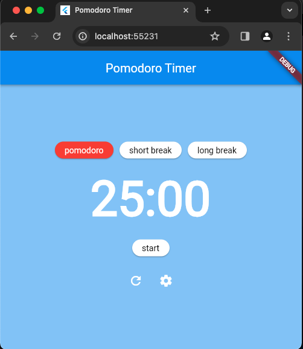

# calculator

A Simple Pomodoro App for Flutter Learning Practice.


## Install Flutter
1. [Install Flutter](https://docs.flutter.dev/get-started/install)
2. [Setup VSCode](https://docs.flutter.dev/get-started/editor?tab=vscode)

## Run App (on Windows)
1. Open PowerShell:
   - Press `Win + S`, type `PowerShell`, and select "Windows PowerShell."

2. Navigate to code repo:

For example, when code is located at ``pomodoro``:
```
cd pomodoro
```

Install dependencies:
```
flutter pub get
```

3. Launch web app at port ``8080``:
```
flutter run -d chrome --web-port=8080
```
Press `Q` or `Ctrl+C` to terminate app



4. Edit code & Hot reload:
- Add/edit code at VSCode
- Switch to PowerShell terminal then press `r` to apply changes

## TODOs:

Implement the functionality for the Pomodoro Timer app based on the provided code structure. The app should allow users to start, and reset the timer, as well as switch between Pomodoro, Short Break, and Long Break modes. The app should also keep track of the number of completed Pomodoro cycles and display notifications when each interval is completed.

To envison how this app should work, please visit a similar app here: https://studywithme.io/aesthetic-pomodoro-timer/

## Pomodoro / Short Break / Long Break Mechanism:

The Pomodoro Technique is a time management method that uses a timer to break work into intervals, typically 25 minutes in length, separated by short breaks. Here's how the mechanism works:

1. Pomodoro: The Pomodoro interval is the core working period, usually lasting 25 minutes. During this time, the user focuses on a specific task without interruptions. When the Pomodoro interval is completed, the app should start a Short Break interval automatically.

2. Short Break: The Short Break interval is a brief rest period, typically lasting 5 minutes. It allows the user to relax, stretch, or perform any quick tasks. After the Short Break, the app should start the next Pomodoro interval. After completing a set number of Pomodoro intervals (e.g., 4), the app should start a Long Break instead of a Short Break.

3. Long Break: The Long Break interval is an extended rest period, usually lasting 15-30 minutes. It provides a longer break after completing a set of Pomodoro intervals. The Long Break allows the user to recharge and prepare for the next set of Pomodoro intervals. After the Long Break, the app should start a new set of Pomodoro intervals.
The app should keep track of the number of completed Pomodoro cycles (1 cycle = Pomodoro + Short Break or Pomodoro + Long Break) and display it to the user.


## Learning Sources:
1. [Dart Language](https://dart.dev/language)
2. [Dartpad](https://dartpad.dev/?)
3. [Flutter UI](https://docs.flutter.dev/ui)
4. [Flutter Interaction](https://docs.flutter.dev/ui/interactivity)